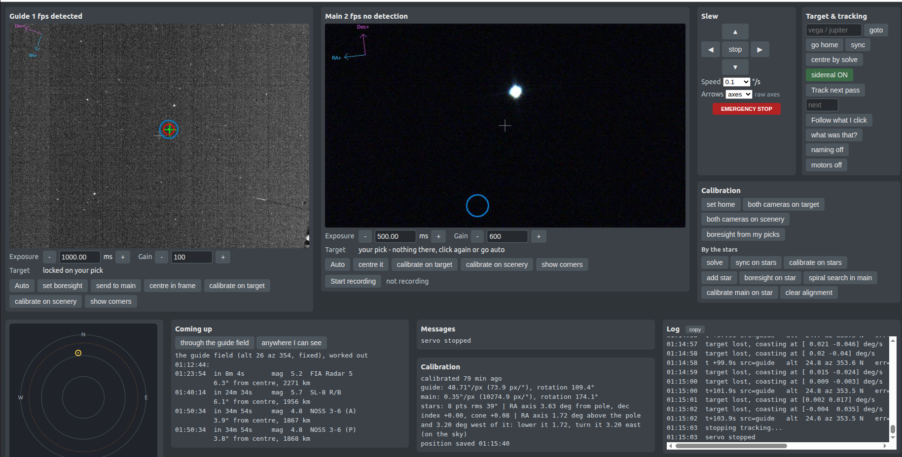

# ISS closed-loop tracker

EQ3-2 (steppers, Arduino Uno + 2x DRV8825) · 150/750 Newtonian with a 2x Barlow (1500 mm) + ASI290MC ·
ASI120MM Mini guide camera with a 16 mm lens (15.5 mm measured) · Raspberry Pi 5.



*The console on 2026-09-30: the guide (left, 17.7° field) locked on a picked object, the main camera
(12.9' x 7.3' field) with a star in view, the mount and calibration controls on the right, and along
the bottom the sky chart, the **Coming up** list of bright satellites due through the guide field,
messages, the calibration summary and the log.*

## What it does

It follows the ISS and other satellites with a small German equatorial mount, on a balcony with a
restricted view and without polar alignment, and records them with the main camera:

* **Star alignment by plate solving.** The guide camera's frames are solved against a star catalogue,
  which calibrates the guide camera and fits a pointing model of the mount - however the tripod
  stands. It reports the polar error as a correction you can make.
* **Two tracking modes.** *Pass mode* follows a TLE prediction and corrects it from the cameras.
  *Servo mode* follows whatever you click in the guide image, with no orbit at all.
* **Satellite names.** It names what it is following, live in the guide caption and after the
  session, and lists the bright satellites due through the guide field in the next hour.

**Verified on the real rig** (2026-09-28/30): firmware and serial protocol, both cameras, plate
solving (0.2-0.6 s on the Pi), star alignment (39" rms, 8 points), goto and sync through the
pointing model, the spiral search finding a star in the main camera, and a first real servo track:
NOSS 3-8 (B), a classified satellite, held on the guide boresight to under a pixel (20-45") for 80 s,
then named afterwards from the log.

**Verified in simulation only so far**: the guide -> main handoff, pass mode end to end, shadow and
obstruction coasting, SER recording. See [Known limits](#known-limits--next-steps).

## How it works

```
TLE (Celestrak) --> Skyfield --> refracted alt/az --> HA/Dec --+
                                                               |  pointing model (plate-solved
                                                               +-> star alignment) -> axis angles
                                                                          |
                                           cubic-spline trajectory, feed-forward rates  (pass mode)
                                           or rates estimated from the camera           (servo mode)
                                                                          v
 guide cam (17.7 deg) --+                     +--------------------+   R rate1 rate2   +---------+
                        +--> blob centroid -->| offset estimator   |------------------>| Uno ISR |--> DRV8825
 main cam (12.9' x 7.3')+   px -> axis deg    | time offset (along)|<------------------| stepper |
                            via camera matrix | alpha-beta (cross) |   P pos1 pos2     +---------+
                                              +--------------------+
```

* **Inner loop** (50 Hz): rate = feed-forward rate + Kp x (target - step-count position), with a
  stopping-distance limit to avoid overshoot.
* **Outer loop** (every frame): the detected pixel is converted to axis angles with the calibrated
  camera matrix (axis1 column scaled by cos Dec). In pass mode the error against the prediction is
  split into an along-track **time offset** (TLE timing error, the dominant one) and a cross-track
  **axis offset**. In servo mode there is no prediction: the same filter estimates the target's
  position and rate from the camera alone. The guide acquires; the main camera takes over after
  `main_handoff_frames` consecutive detections and hands back if it loses the target.
* **Pointing model** ([model.py](issctl/model.py), [align.py](issctl/align.py)): the mount as a
  two-axis gimbal of unknown orientation - polar axis direction, Dec index and cone error - fitted
  to plate-solved pointings. Goto, sync, sidereal tracking rates and pass planning all go through it.
* **Firmware**: Timer1 at 20 kHz, phase-accumulator stepping for both axes, per-axis accel ramps,
  0.5 s watchdog. 1/16 microstepping -> RA 2600 steps/deg, Dec 1300 steps/deg.

## Layout

| Path | What |
|---|---|
| `firmware/issmount/issmount.ino` | Uno firmware (pinout = your `serialSpeed.ino` wiring) |
| `issctl/predict.py` | TLE fetch, passes, pier-side planning, trajectories, Earth's shadow |
| `issctl/geometry.py` | alt/az <-> HA/Dec <-> mount axes |
| `issctl/model.py`, `align.py` | pointing model; star alignment, sync, star calibration of the guide |
| `issctl/solve.py` | star detection and plate solving (astrometry.net's `solve-field`) |
| `issctl/mount.py` | serial driver + simulated mount |
| `issctl/camera.py`, `detect.py` | ZWO + V4L2 capture threads, blob detection |
| `issctl/calib.py` | camera <-> axis calibration on a point source, boresight |
| `issctl/search.py` | spiral search for a star in the main camera; main calibration on that star |
| `issctl/control.py` | tracking controller (pass and servo mode) |
| `issctl/identify.py` | "what was that?": name the satellite a session followed, live and afterwards |
| `issctl/forecast.py` | "Coming up": bright satellites due through the guide field or the sky |
| `issctl/mask.py` | sky obstructions (balcony, window frame, buildings) |
| `issctl/sim.py` | simulated sky for end-to-end testing |
| `issctl/preview.py`, `web/` | browser control panel |
| `issctl/ser.py` | SER recorder for the main camera |
| `issctl.sh` | wrapper that runs `issctl` with the project virtualenv, from any directory |

## Setup on the Pi 5

```bash
sudo apt install python3-venv astrometry.net
python3 -m venv --system-site-packages .venv && .venv/bin/pip install -r requirements.txt
sudo usermod -aG dialout $USER       # serial access to the Arduino (log out and back in)
cp config.example.toml config.toml   # set site lat/lon/elevation - this file is gitignored
./issctl.sh solve-setup              # fetch the star index files plate solving needs (once)
```

`config.toml` is layered over `config.example.toml`, so it only needs the settings you change.
`solve-setup` downloads the Tycho-2 index files that match the guide field (4111-4118 for 17.7 deg)
into `data/astrometry/`; after that plate solving works offline.

The satellite catalogues are downloaded into `data/catalog/` on first use and refreshed once a day
(see [Satellites](#satellites-what-was-that-and-coming-up)). Both folders are gitignored.

### ZWO camera SDK (`libASICamera2.so`)

The cameras need ZWO's closed-source library, which is **not** on PyPI: the `zwoasi` package is only a
wrapper around it. Easiest on Debian/Ubuntu/Raspberry Pi OS, from the INDI PPA:

```bash
sudo add-apt-repository ppa:mutlaqja/ppa   # Raspberry Pi OS: see indilib.org for the repo line
sudo apt install libasi                    # installs libASICamera2.so + udev rules
```

Alternatives, in order of convenience:

* **You may already have it.** FireCapture, INDI and the ZWO desktop apps all ship it - e.g.
  `/opt/FireCapture_v2.7/libASICamera2.so`. `find / -name 'libASICamera2*'` will say.
* **Download from ZWO** (astronomy-imaging-camera.com, "Developers" / ASI Camera SDK), pick the right
  architecture - **arm64 for a 64-bit Pi**, x86-64 for a PC - and copy it to `/usr/local/lib`, then
  `sudo ldconfig`.

The code searches `/usr/local/lib`, `/usr/lib`, the multiarch paths (x86-64 and aarch64) and any
FireCapture install, so usually no config is needed; `[cameras] sdk_lib` overrides the search. If it
cannot find it the error lists everywhere it looked.

**udev rules matter too**: without them the cameras need root, and USB transfers can be capped. The
`libasi` package installs them; with a manual SDK copy `asi.rules` into `/etc/udev/rules.d/` (it is in
the SDK archive) and replug the camera.

The ASI120MM **Mini** is a USB 2.0 camera: its gain range is 0-100 (not the 0-600 of the USB 3
bodies) and it has no HighSpeedMode control. The code clamps every control to what the body
reports, so the start-up messages about both are expected.

### Non-ZWO guide cameras (V4L2)

Set `driver = "v4l2"` on a camera to use any V4L2 device instead - a **Philips SPC900NC** (`pwc`
driver), a UVC webcam, a capture stick. With the same 16 mm lens an SPC900NC (640x480, 5.6 um) gives
**12.8 x 9.6 deg at 72"/px**: a smaller field than the ASI120MM's, still ample for the handoff.

Install `v4l-utils` (`sudo apt install v4l-utils`) so exposure and gain go through `v4l2-ctl`;
without it the code falls back to OpenCV's properties, which many drivers ignore. Control names
differ per driver, so list them and put the right ones in the config:

```bash
v4l2-ctl -d /dev/video0 --list-ctrls        # names, ranges and units
```

The SPC900NC is a **colour** CCD, 2-3x less sensitive than the mono ASI120MM, and its exposure is
capped near 1/25 s unless long-exposure modified - too short for plate solving. The lens also needs
an adapter: the SPC900's thread is not CS.

### Running it

Run everything through `./issctl.sh <command>`, which uses the virtualenv's Python and works from any
directory. The console usually runs headless on the Pi and is used from a browser:

```bash
./issctl.sh console --web --port 8090      # then open http://<pi>:8090/ on a laptop or phone
```

**Clock accuracy matters**: 1 s of clock error = up to 1 deg of along-track error at zenith. Use NTP
(chrony) in the field, or a GPS dongle.

If the CH340 Arduino shows in `lsusb` but no `/dev/ttyUSB0` appears (Ubuntu desktop), `brltty` is
stealing it: `sudo apt remove brltty`.

## Flash firmware

```bash
arduino-cli core install arduino:avr
arduino-cli compile --fqbn arduino:avr:uno firmware/issmount
arduino-cli upload -p /dev/ttyUSB0 --fqbn arduino:avr:uno firmware/issmount
```

## A night at the telescope

No polar alignment is needed - the star alignment measures however the tripod stands. Each step is
a button in the browser; the sections below explain them.

1. **Once, for a new build: axis directions.** `./issctl.sh mount-test` runs each axis +/-0.5 deg/s.
   Check the measured motion matches (verifies `gear_ratio`/`microsteps`), and set the `reverse`
   flags so that axis1 + is the sidereal direction and, on the east-looking side, axis2 + is toward
   the pole. It moves only ~1 deg each way, so it is the safe way to find out which way the motors
   turn.
2. **Home.** Put the tube in the [home position](#starting-position-home) and press **set home**.
3. **Point at stars.** **goto** a star away from the pole (e.g. `mizar`, `vega`), turn **sidereal**
   on, set the guide exposure to 0.5-2 s, then **sync on stars**.
4. **Calibrate the guide and align the mount: calibrate on stars.** Then do it again somewhere at
   least 20 deg away and look for **AGREE** in the messages - see
   [Star alignment](#star-alignment-and-the-guide-camera).
5. **Main camera.** goto a bright star, **centre by solve**, then **spiral search in main** if the
   main camera does not see it, and **calibrate main on star** - see [Main camera](#main-camera).
6. **Guide boresight.** With the star in the middle of the main image, press **set boresight** on
   the guide and click the star: the click snaps to the nearest bright spot.
7. **Track.** Pick a pass in **Coming up** - the ISS or any bright catalogued satellite - and press
   **Track selected**, or **Follow** in the guide panel (servo) for anything you can see. Start and
   stop recording yourself. Keep the page open: it carries the
   [emergency stop](#emergency-stop). Recording goes to `captures/*.ser`, the control log to
   `logs/track-*.csv` or `logs/servo-*.csv`.

`./issctl.sh passes` lists the coming ISS passes, the pier side, trackable and sunlit seconds, peak
rates, and what limits each pass.

## Starting position (home)

**Counterweight straight down, tube parallel to the polar axis** (pointing at the celestial pole).
That pose is what the software calls axis1 = 0, axis2 = 90, and everything else is measured from it.

1. Put the mount in that pose by hand - a degree or two out is fine.
2. Start `console` and press **set home** (`H` in the terminal).
3. **sync on stars** removes what is left.

**Why it matters:** the Uno resets when the serial port opens, so its step counters always start at
zero. The console saves the position every few seconds and restores it on start-up
(`position restored: ... - re-home if the mount was moved by hand`), so a restart is fine as long as
nobody moved the tube. If someone did, press **set home** with the tube at home, or simply
**sync on stars** from wherever it points: sync re-indexes the counters through the pointing model
and keeps the alignment.

**How exact?** Not very. What home needs to be is roughly right, so that the first slew goes the
right way and `axis1_hour_limit` means what it says - a home that is 90 deg out can swing the tube
into the tripod or the railing. **Before any large move**, check cable slack and clearance.

## Star alignment and the guide camera

The guide camera sees 17.7 x 13.3 deg at 49.9"/px, which always holds enough stars to plate-solve.
That one fact does three jobs.

**solve** plate-solves the current guide frame and says where the tube really points and what is in
view. **sync on stars** sets the mount's counters from that. The detector
([solve.py](issctl/solve.py) `find_stars`) smooths the frame by about a star's width first - on a 1 s,
8-bit guide frame the single-pixel noise otherwise outnumbers the faint stars - and rejects lit
windows and walls by their shape, so a frame with buildings in it still solves.

**calibrate on stars** measures the guide camera's matrix and aligns the mount in one go: it solves a
frame, moves one axis by `star_cal_step_deg` (1 deg), solves again, and does the same for the other
axis. Each frame is solved on its own, so nothing has to stay in view between moves. From those
solves it gets:

* the guide matrix (scale, rotation, flip), and the focal length the stars imply - it warns if that
  differs from `focal_length_mm` (the 16 mm lens measured 15.5 mm);
* the real angle each axis turned against what the counters said (the RA drive gives ~3.5% short
  measure; the report flags anything over 3%);
* four alignment points and the direction of both turning axes, which fit the pointing model:
  polar axis direction, Dec index and cone error. Cone is only fitted once points span 30 deg of sky.

It prints the polar error of the mount as a correction:

```
guide: this run alone: RA axis 1.00 deg below the pole and 2.00 deg east of it: raise it 1.00, turn it 2.00 west (on the sky)
guide: vs the previous run 28 deg away (independent check): polar axis 0.02 deg apart, camera rotation +0.08 deg, scale +0.00% - AGREE
```

**Repeat it at least 20 deg away.** Each run is compared with the previous one: the polar axis must
agree to 0.5 deg, the camera rotation to 0.5 deg and the scale to 1%, otherwise the messages say
DISAGREE and why. One run's polar axis rests on a ~1 deg turn, so it is only as good as the solves:
about 0.1 deg with 2" solves, 0.6 deg with 10" (simulation). A bigger `star_cal_step_deg` tightens
it, where the window allows. Runs closer than 20 deg only show repeatability.

**Stay away from the pole** (Dec above ~60 deg): axis1 there rotates the field instead of shifting it.
From a north-facing balcony that means pointing low - the same azimuth at alt 20 is Dec ~58.

**Brightness** (guide panel): press it, then click a star or a satellite in the guide image. A plate
solve of a fresh frame gives the catalogue star there with its magnitude, and a *measured* magnitude
from the frame's own zero point, fitted to every Tycho-2 star the solve matched - so it also works
for a satellite, which no star catalogue has. On the real guide frames the measured magnitudes
agree with Tycho-2 to 0.3-0.6 mag; the spread is given with each answer.

Other star tools: **add star** adds the current pointing as another alignment point; **clear
alignment** forgets the model - only after the tripod itself moved. The model is kept in
`data/state.json`.

## Main camera

With the Barlow the main camera sees only 12.9' x 7.3' - about 9 x 16 guide pixels - so getting a
star into it and measuring it needs its own tools.

**Spiral search in main** walks a square spiral round the current pointing, one main field per step
(4.6'), out to `search_radius_deg` (30'), pausing `search_dwell_s` (1.5 s) at each stop. **You decide
when it has found the star**: the button turns into **Stop here** while it runs - press it when the
bright star is in the main image and the mount stays at that stop. (It used to stop by itself on
the first thing main detected; on the rig that was the wrong star.) Every stop is approached from
the same side, so the ~10' of Dec backlash cannot leave holes; left alone, it covers the whole
square and returns to the start.

**calibrate main on star** measures the main camera's matrix in its own pixels: each axis goes to
-1.8', 0 and +1.8' about the start, always arriving from the same side, and a line through the three
star positions is that axis's column. It takes up the Dec slack first, and if that moves the star
out of view it steps back until it reappears. It checks the axes are ~90 deg apart, the scale matches
the optics (0.399"/px at 1500 mm), axis1/axis2 matches cos(Dec) and the star comes back where it
started, and refuses a result whose axes are more than 10 deg from square. Then it centres the star.

Calibrating the main camera *against the guide* (the older **calibrate on target**, now only `c`
in the terminal console) does not work at this ratio: moves that keep a star inside 7' shift the guide image by
1-4 px, and the ratio against that came out 15-20% wrong on the rig.

**Main's aim point is its frame centre**, shown as a grey cross. The **guide boresight** - the green
cross in the guide image - marks where that centre looks: set it with **set boresight** on the guide
(clicks snap to the nearest bright spot), or **boresight on star**, which identifies the main
camera's star in the guide's plate solve.

### Without stars

The page only offers the star-based calibrations: **calibrate on stars** for the guide and the
mount, and **calibrate main on star** for the main camera. The older way - following one bright
point source (a distant lamp, a planet) through small moves - is still there from the terminal
console, `c` (**calibrate on target**), for a cloudy night. It calibrates main against the guide,
which came out 15-20% wrong on the rig, so prefer the star tools whenever there are stars.
Calibration on scenery and "boresight from my picks" were removed on 2026-09-30.

Mount the cameras at any angle: the matrix absorbs rotation and flip. Tolerance to a *wrong*
calibration, from `--cal-rot-error` in simulation:

| Rotation error | Main camera in control | Median error | Outcome |
|---|---|---|---|
| 0 deg | 39% | 30" | fine |
| 30 deg | 38% | 19" | fine |
| 60 deg | 1% | 1038" | fails to settle |
| 85 deg | 0% | - | never locks |

Scale is less forgiving where it matters: 15% is fine, 30% loses the guide -> main handoff.

**Redo the calibration** after rotating either camera, changing the focal length (the Barlow: also
set `focal_length_mm`), refocusing the guide lens, or moving the guide scope on the tube. Not needed
after moving the tripod - that is a new star alignment, not a new calibration.

## Tracking

**Pass mode** (**Track selected** in **Coming up**, `p` in the terminal for the next ISS pass, or
`./issctl.sh track`) plans the pass through the pointing model and the sky mask, slews to the start
`lead_s` early - or straight to the satellite if it is already up - and follows the prediction,
correcting timing and cross-track error from the cameras. It works for **any satellite** in the
catalogues, classified ones included. From the command line: `./issctl.sh passes --sat 42065`,
`./issctl.sh track --sat 42065` (a name or NORAD number; the ISS without `--sat`).

The cameras only take over once the target is really there: before the first lock nothing counts
until the pass has started and the mount has arrived, the guide searches only within
`acquire_radius_arcmin` (3 deg) of the prediction, and a blob must hold still in the frame while the
stars drift past. The main camera then only confirms what the guide has - it must agree with the
estimate to `main_agree_arcmin` (3') - so a star in its small field cannot take over. A click in
either image overrides all of this: it means "that one". In simulation, pass mode on
NOSS 3-8 (B) kept the main camera in control 96% of the run at a median 10".

**Servo mode** (**Follow**, at the right of the guide's exposure row; `v`, or `track --servo`) follows
whatever you click in the guide image, with no orbit, no site and no alignment - only the camera
calibration. The position and rate come from the camera alone (`servo_alpha`/`servo_beta`). Like
**set boresight**: press **Follow** (it says **Click the object**), then click the object in the
guide image, and the session starts locked on it. A later click in the image moves the lock to
what you clicked, so if it has grabbed a star, click the satellite. It stops by itself after `servo_give_up_s` with nothing
detected. This is what works for any satellite you can see, and on a mount facing the wrong way:
in simulation, with the tripod turned 90 deg in azimuth, pass mode is 78 deg off while servo mode holds
the target to a median 5-7" on the main camera.

For a satellite, shorten the guide exposure first: 8 ms for the ISS, 50-200 ms for fainter ones. At
1 s a satellite smears into a streak and the stars are the sharpest things in the frame - and with
sidereal tracking off a star drifts slowly through the image, so a click can lock servo onto a star.

While tracking, each camera caption says whether the loop is steering with it
(`TRACKING uses this camera`), standing by (on main with the handoff count, e.g.
`standby (handoff 2/3 frames)`), or coasting on prediction.

## Satellites: "what was that?" and "Coming up"

Both use the same catalogues, kept in `data/catalog/` and refreshed at most once a day:

* CelesTrak's **active** satellites and its **visual** group (the brightest objects, some rocket
  bodies included);
* **Mike McCants' classified orbits** (`classfd.tle`), observed by amateurs - the NOSS pairs and other
  military satellites are only there;
* McCants' **standard magnitudes** (`qs.mag`), for brightness.

The full catalogue - most old rocket bodies, often the brightest things up there - needs a Space-Track
account and is not used, so the answers are only as complete as the lists above.

**what was that?** names the satellite the last session followed. From the log it rebuilds the object's
own sky track - the counters through the pointing model, plus where the object sat in the guide image
through the guide matrix - and ranks every catalogued satellite by how closely it flew that path at
the same moments. It answers with a name, "probably" a name, both members of a formation pair, or
"nothing in the catalogues flew this path" (an aircraft, a star, or an object no catalogue carries).
It runs by itself when a session ends, and live during it: the guide caption shows the name within
~15 s of locking. **naming on/off** switches both automatic runs; the button works either way. From
the command line: `./issctl.sh identify [logs/servo-....csv]`.

Each session saves the pointing model it ran with next to its log, so a later re-alignment cannot
skew the answer. The mount's own alt/az columns in the log are *not* used - see
[Known limits](#known-limits--next-steps).

**Coming up** lists the bright satellites due in the next `[forecast] minutes` (60):

* **Through the guide field** - held fixed on the stars when sidereal tracking is on, otherwise fixed
  where the tube points;
* **Anywhere** - above `min_altitude` and inside the sky mask.

Only satellites that are sunlit while the sky here is dark (sun 6 deg below the horizon or more) are
listed, with a countdown, the estimated magnitude, where it will be and its range. The brightness
comes from the standard magnitude, the range and the phase angle - good to about a magnitude, and a
tumbling rocket body does what it likes. The best hours are the first two after dusk and before dawn;
around midnight most low satellites are in Earth's shadow. Click a row to pick it: its path is drawn
on the sky chart in violet, with a dot where it is now (a hollow circle where it will come in).
**Track selected** at the top of the list plans and tracks that pass in pass mode.

## Browser control panel

`track` and `console` serve a page on `[preview] port` (override with `--port`). With `--web` there is
no terminal UI at all, which suits a phone at the mount.

**Each camera panel** has the live view with the aim cross, search gate (blue) and detection (red) -
image only, no text burned in, so it matches the raw sensor data. On the guide the cross is green
and marks the boresight; on main it is a plain grey cross at the frame centre. Under it: exposure and
gain, as `-`/`+` steps or an exact value; the target selection (click the image to pick an object,
**Auto** to go back to the brightest); and the calibration buttons. **Start/Stop recording** sits
under the main frame, since that is the camera it records: each start writes a new
`captures/iss-*.ser`, and recording pauses by itself while the target is in shadow or behind a mapped
obstruction. Exposure and gain are remembered across restarts.

**Slew**: the arrow pad with a speed selector. The *Arrows* selector starts on **axes**, which drives
axis1/axis2 directly; with `guide` or `main` selected, right moves the target right in that camera's
picture and up moves it up, whatever the camera's rotation, through its matrix.

**Target & tracking**: goto/sync by name (`vega`, `jupiter`, `moon`, or `18.6 38.8`), go home,
**centre by solve** (put a named object on the guide boresight using the plate solve, not the
counters), sidereal on/off, **what was that?**, **naming on/off**, motors off. **Follow** sits at the right of
the guide's exposure row: the guide is the only camera it follows from. **Go to point** under the
sky chart slews to a point clicked on the chart and holds it still.

**Calibration**: set home and the star tools. Along the bottom: the
sky chart with the coordinates under it, **Coming up**, **Messages**, the **Calibration** summary
(matrices, star alignment, polar error), **Warnings** and the **Log**.

**One session can do the whole evening.** **Track selected** hands the mount to the tracker and
switches the page to tracking mode - the jog/goto/calibrate controls grey out, the sky chart shows the
pass and a countdown, and the button becomes **Stop tracking**, which gives the mount back (so does
the slew pad's **stop**). Recording is never started or stopped for you in the console.
The sky chart under it shows the axes' current rates in deg/s.
`./issctl.sh track` still exists for a headless one-shot run, but it would fight the console over
the serial port and cameras, so run one or the other.

The terminal console has the same controls on keys: arrows jog, `t` sidereal, `g` goto, `s` sync,
`H` home, `c` calibrate on target, `S` solve, `Y` sync on stars, `K` calibrate on stars,
`A` add star, `B` boresight on star, `p` pass, `v` servo, `f` arrow frame, `x` camera,
`-`/`=` exposure, `[`/`]` gain, `X` emergency stop, `q` quit.

### Emergency stop

A red **EMERGENCY STOP** sits in the slew panel in both `console` and `track`, and `X` does the same
in the terminal console. Unlike the pad's `stop` button (which only drops the jog), it:

* sends the firmware's `X` command - rates to zero immediately, with no deceleration ramp;
* cancels sidereal tracking and any jog;
* aborts a running goto, sync, calibration or search, and abandons a pass;
* stays latched until your next deliberate command.

Because it skips the ramp it **can lose steps**, so **sync on stars** before trusting the position
afterwards. Two other safety nets exist: the firmware halts both axes if no command arrives for 0.5 s
(so a crashed Pi or unplugged USB stops the mount), and `Ctrl-C` stops motion on the way out. The
console's keepalive survives a garbled serial reply rather than dying and leaving the mount stopped.

## Simulation (no hardware)

```bash
./issctl.sh console --sim --web --port 8090   # simulated mount, cameras, a "distant light", a tilted tripod
./issctl.sh track --sim --speed 2 --no-preview
./issctl.sh track --sim --port 8090            # watch it in the browser, real time
./issctl.sh track --sim --servo --azimuth-error 90   # servo mode on a tripod turned 90 deg
./issctl.sh track --sim --clouds 3             # unpredicted dropouts
./issctl.sh track --sim --cal-rot-error 45     # deliberately bad camera calibration
./issctl.sh track --sim --record               # exercise the SER writer
.venv/bin/python -m pytest -q tests
```

The simulator injects a 1.5 s TLE timing error, a cross-track offset, 0.35/-0.25 deg pointing error and
an imperfect camera calibration (3% scale, 2 deg rotation). Simulation writes `data/state-sim.json`, so
it never overwrites the real calibration. Plate solving is simulated from the known sky; three real
guide frames in `tests/data/` exercise the real solver.

## Earth's shadow

The ISS is only visible while sunlit, and passes routinely fade out partway through (evening) or
appear partway in (morning). `illumination()` computes a conical umbra/penumbra with an 80 km
absorbing shell, so the fade takes a few seconds, as it does in reality.

* `issctl passes` reports `lit` (sunlit seconds above the horizon), `usable` (trackable **and** lit)
  and when the ISS enters or leaves shadow. Passes are chosen by `usable`, not by altitude.
* While the ISS is in shadow the tracker ignores the cameras and coasts on prediction, keeping the
  learned offsets. With the ISS invisible the brightest blob in the frame is a **star**, and following
  it would drag the mount away. On shadow exit the gates reopen and it re-acquires.
* SER recording pauses in shadow.

Coasting accuracy in simulation (165 s of shadow after a 104 s lit segment): median 199", 95th
percentile 693" - inside the main camera 69% of the time and always inside the guide field, so a
morning re-acquisition should succeed.

## Obstructions and clouds

**Mapped obstructions** (balcony walls, window frame, neighbouring buildings) go in `config.toml` as
azimuth/altitude rectangles:

```toml
[site.sky]
openings = [[100, 260, 18, 80]]   # a south-facing balcony
blockers = [[168, 176, 0, 90]]    # a window frame post
```

Empty `openings` means the whole sky above `min_altitude`. `issctl passes` then reports `blocked`
seconds and splits each pass into **usable windows**, the tracker coasts through a mapped obstruction
as it does through shadow, and **Coming up -> Anywhere** lists only what the openings show.
`m` in the terminal console prints the azimuth/altitude of the current pointing, for the config.

**Clouds** cannot be predicted, so the tracker keeps following its model and keeps looking. It does
not lock onto a star in the gap: once locked, detections that imply a jump beyond
`max_offset_jump_arcmin` are rejected, and that limit and the search circle around the boresight grow
only slowly while coasting (`reacquire_growth_arcmin_per_s`, capped at `max_reacquire_arcmin`).

Simulated results for the same pass (104 s lit, then shadow):

| Case | Median error while coasting | Inside main FOV |
|---|---|---|
| 3 cloud gaps (4-12 s) | 54" | 100% |
| Mapped building (30 s) | 184" | 100% |
| Earth's shadow (165 s) | 209" | 68% |

## Known limits / next steps

* **The guide -> main handoff has not happened on the real sky yet.** The first real servo track held
  its target on the guide only, because the main matrix was then calibrated against the guide and
  15-20% off. **calibrate main on star** is built to fix that and is waiting for a clear night.
* **The balcony's view is not mapped** (`openings = []`), so "Anywhere" also lists passes
  behind the wall or buildings. A detailed map is not worth it: the window frame is close, so any
  small move of the tripod shifts its edges by degrees. Pass mode does not need it - it follows the
  prediction behind the wall and the guide picks the satellite up when it comes into view. If a
  filter is ever wanted, a coarse sector (azimuth range and minimum altitude) survives tripod moves.
* **Next: faint satellites in pass mode.** Before its first lock the tracker searches the whole
  guide frame and trusts the brightest blob - right for the ISS, wrong for a mag 5 satellite next to
  a mag 2 star. Planned: search only round the predicted position, and accept only a blob that stays
  still in the frame while the stars stream past (the mount follows the prediction). Later:
  automatic guide exposure from the predicted brightness; for now exposure is set by hand.
* **The tracker logs alt/az for an ideal, polar-aligned mount** (`control.py`, `Tracker.altaz`),
  several degrees off on this tripod. Identification does not use those columns; the fix is to go
  through the pointing model.
* **USB**: the guide camera sometimes stalls or drops off the bus - it is reopened automatically,
  and start-up survives it re-enumerating when the console restarts. Keep the Arduino and the guide
  camera on separate buses and the guide cable away from the Dec motor.
* **`axis1_hour_limit` limits meridian passes**: a pass crossing the meridian needs the counterweight
  high, and real passes lose 150-170 s of 370 s at a limit of 120 deg. Raising it recovers most of
  that **if the tube clears the tripod and railing**.
* **Backlash**: moves that matter (star calibration, spiral search, main calibration, centring)
  approach from one side; the tracking loop does not compensate, so a Dec reversal mid-track shows
  as a short error transient.
* Camera latency (`latency_s`) and `command_latency_s` should be tuned from real logs.
* Sensors (accelerometer for tilt, magnetometer for repeatability) were considered and postponed:
  the plate-solved alignment does their job.
